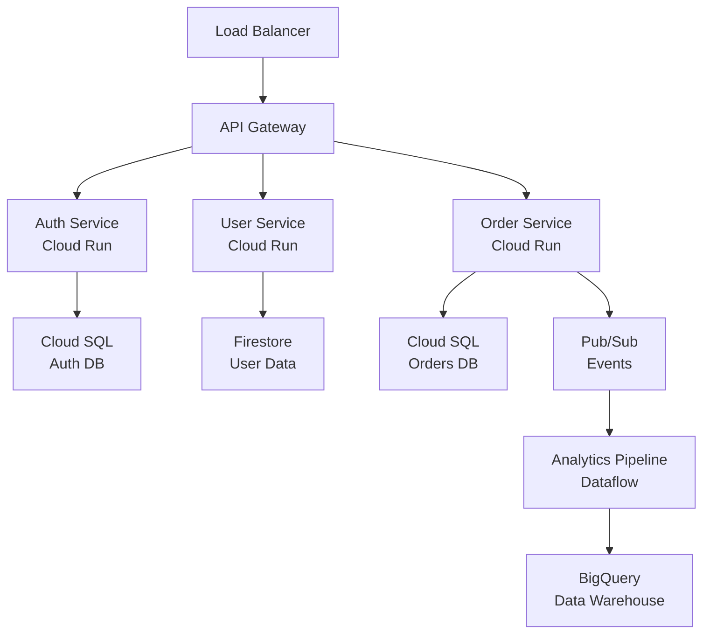
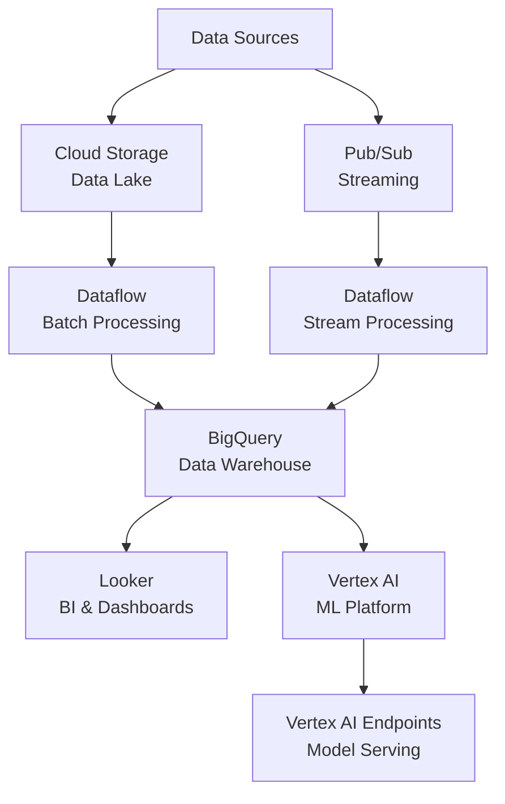
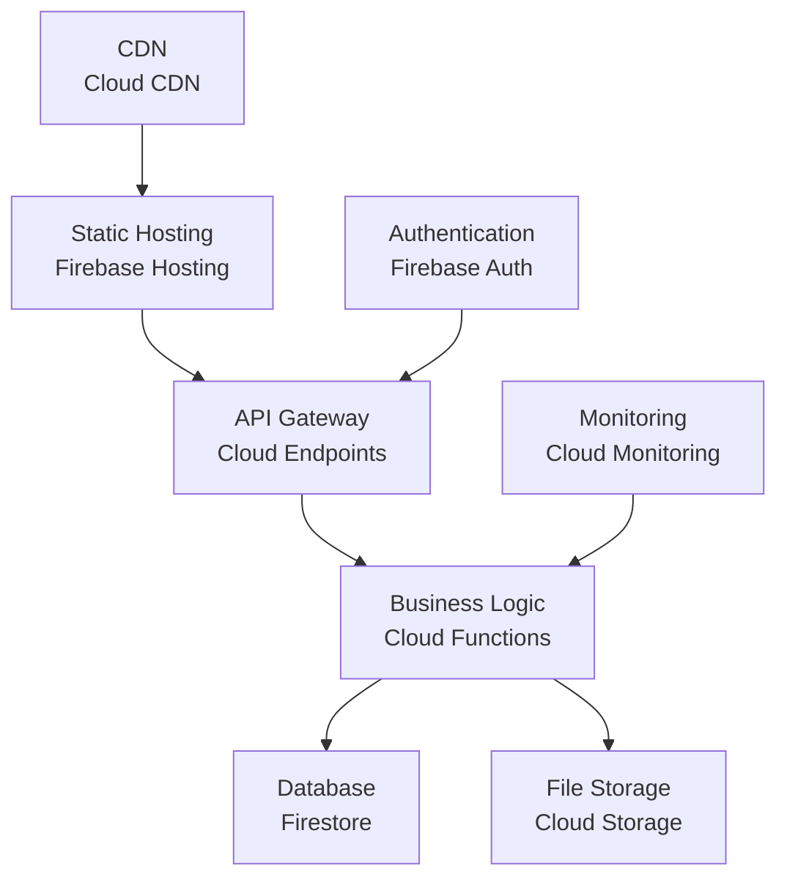

# **Task: Architecture Design (Google Cloud Platform)**

Design scalable, secure, and cost-effective cloud architectures following Google Cloud best practices and the Well-Architected Framework.

## **Pre-Design Research Phase**

Before designing architecture, leverage MCP tools for comprehensive architectural context:

1. **Context7 Research**: Use `"use context7"` for current GCP services and Terraform documentation
   * Example: `"GCP Cloud Run and BigQuery integration patterns, use context7"`
   * Get latest service capabilities, pricing, and architectural best practices

2. **Architecture Pattern Analysis**: Use Consult7 to analyze existing infrastructure patterns
   * Review `/terraform/` directory for established infrastructure patterns
   * Understand current service configurations and architectural decisions
   * Identify opportunities for optimization and consolidation

3. **Best Practices Research**: Use DuckDuckGo for current cloud architecture trends
   * Search for latest GCP architectural patterns and cost optimization strategies
   * Example: "GCP microservices architecture best practices 2025"

4. **Reference Architectures**: Use GitHub tools to study enterprise cloud implementations
   * Find examples of scalable, secure GCP architectures in similar domains
   * Analyze Terraform modules and infrastructure documentation patterns

## **Architecture Design Process**

## **Architecture Design Process**

### **1. Requirements Gathering**
- **Functional Requirements**: What the system must do
- **Non-Functional Requirements**: Performance, scalability, security, compliance
- **Business Constraints**: Budget, timeline, existing systems
- **Technical Constraints**: Technology preferences, skills, compliance requirements

### **2. High-Level Design**
- **System Context**: External systems and users
- **Major Components**: Core services and data flows
- **Integration Points**: APIs, data exchange, authentication
- **Deployment Strategy**: Multi-region, disaster recovery, scaling

## **GCP Service Selection Guidelines**

### **Compute Services Decision Tree**
```
Need serverless? 
├── Yes → Event-driven? 
│   ├── Yes → Cloud Functions
│   └── No → Cloud Run
└── No → Containerized?
    ├── Yes → GKE (complex) or Cloud Run (simple)
    └── No → Compute Engine
```

### **Data Storage Decision Matrix**
| Use Case | Service | When to Use |
|----------|---------|-------------|
| Transactional | Cloud SQL | ACID compliance, complex queries |
| NoSQL Document | Firestore | Real-time, mobile/web apps |
| Analytics | BigQuery | Data warehouse, large-scale analytics |
| Object Storage | Cloud Storage | Files, backups, static content |
| In-Memory | Memorystore | Caching, session storage |
| Graph Data | Cloud Spanner | Global consistency, graph relationships |

## **Architecture Patterns**

### **1. Microservices on GCP**


### **2. Data Platform Architecture**


### **3. Serverless Web Application**


## **Security Design Principles**

### **1. Identity and Access Management (IAM)**
```yaml
# Example IAM policy structure
bindings:
  - members:
    - user:developer@company.com
    role: roles/cloudsql.client
    condition:
      title: "Time-based access"
      description: "Access only during work hours"
      expression: >
        request.time.getHours() >= 9 && 
        request.time.getHours() <= 17

  - members:
    - serviceAccount:app-service@project.iam.gserviceaccount.com
    role: roles/storage.objectViewer
    condition:
      title: "Resource-based access"
      description: "Access only to specific bucket"
      expression: >
        resource.name.startsWith("projects/_/buckets/app-data/")
```

### **2. Network Security Design**
```
VPC Network: production-vpc (10.0.0.0/16)
├── Subnet: web-tier (10.0.1.0/24)
│   ├── Allow: HTTP/HTTPS from internet
│   └── Deny: All other traffic
├── Subnet: app-tier (10.0.2.0/24)
│   ├── Allow: Traffic from web-tier
│   └── Deny: Direct internet access
└── Subnet: data-tier (10.0.3.0/24)
    ├── Allow: Traffic from app-tier
    ├── Private Google Access: Enabled
    └── Deny: All external traffic
```

### **3. Data Protection Strategy**
- **Encryption at Rest**: Customer-managed encryption keys (CMEK)
- **Encryption in Transit**: TLS 1.3 for all communications
- **Data Classification**: Public, Internal, Confidential, Restricted
- **Access Controls**: Principle of least privilege
- **Data Loss Prevention**: DLP API for sensitive data detection

## **Cost Optimization Strategies**

### **1. Compute Optimization**
```yaml
# Compute Engine best practices
machine_type_selection:
  development: e2-micro (shared-core)
  testing: e2-standard-2 (2 vCPU, 8GB RAM)
  production: c2-standard-4 (4 vCPU, 16GB RAM)

scheduling:
  preemptible_instances: true  # For batch workloads
  committed_use_discounts: true  # For predictable workloads
  sustained_use_discounts: automatic  # For long-running instances

autoscaling:
  min_instances: 2
  max_instances: 10
  target_cpu_utilization: 70
  scale_down_delay: 300s
```

### **2. Storage Cost Management**
```yaml
# Cloud Storage lifecycle policies
lifecycle:
  rule:
    - action:
        type: SetStorageClass
        storageClass: NEARLINE
      condition:
        age: 30
        matchesStorageClass: [STANDARD]
    
    - action:
        type: SetStorageClass
        storageClass: COLDLINE
      condition:
        age: 90
        matchesStorageClass: [NEARLINE]
    
    - action:
        type: Delete
      condition:
        age: 2555  # 7 years
        matchesStorageClass: [COLDLINE]
```

## **Performance Optimization**

### **1. Database Performance**
```sql
-- BigQuery optimization example
-- Use partitioning and clustering
CREATE TABLE `project.dataset.optimized_table`
PARTITION BY DATE(created_at)
CLUSTER BY customer_id, product_category
AS
SELECT 
  customer_id,
  product_category,
  order_amount,
  created_at
FROM `project.dataset.source_table`
WHERE created_at >= '2023-01-01';

-- Use approximate aggregation for large datasets
SELECT 
  APPROX_COUNT_DISTINCT(customer_id) as unique_customers,
  APPROX_QUANTILES(order_amount, 100)[OFFSET(50)] as median_order
FROM `project.dataset.orders`
WHERE created_at >= CURRENT_DATE() - 30;
```

### **2. Application Performance**
```yaml
# Cloud Run configuration for performance
apiVersion: serving.knative.dev/v1
kind: Service
metadata:
  name: high-performance-app
  annotations:
    run.googleapis.com/execution-environment: gen2
spec:
  template:
    metadata:
      annotations:
        autoscaling.knative.dev/minScale: "1"
        autoscaling.knative.dev/maxScale: "100"
        run.googleapis.com/cpu-throttling: "false"
    spec:
      containerConcurrency: 100
      timeoutSeconds: 300
      containers:
      - image: gcr.io/project/app:latest
        resources:
          limits:
            cpu: 2000m
            memory: 4Gi
        ports:
        - containerPort: 8080
```

## **Disaster Recovery and Business Continuity**

### **1. Multi-Region Strategy**
```yaml
# Terraform example for multi-region setup
resource "google_compute_global_address" "main" {
  name = "main-ip"
}

resource "google_compute_backend_service" "main" {
  name        = "main-backend"
  protocol    = "HTTP"
  timeout_sec = 10

  backend {
    group = google_compute_instance_group_manager.us_central.instance_group
    balancing_mode = "UTILIZATION"
    capacity_scaler = 1.0
  }

  backend {
    group = google_compute_instance_group_manager.us_east.instance_group
    balancing_mode = "UTILIZATION"
    capacity_scaler = 0.5  # Standby capacity
  }

  health_checks = [google_compute_health_check.main.id]
}
```

### **2. Backup and Recovery**
```yaml
# Automated backup strategy
backup_schedule:
  cloud_sql:
    frequency: daily
    retention: 30_days
    point_in_time_recovery: 7_days
  
  cloud_storage:
    cross_region_replication: true
    versioning: enabled
    retention_policy: 7_years
  
  application_data:
    snapshot_frequency: hourly
    backup_frequency: daily
    cross_region_backup: weekly
```

## **Documentation Requirements**

### **1. Architecture Decision Records (ADRs)**
```markdown
# ADR-001: Use Cloud Run for Microservices

## Status
Accepted

## Context
Need to deploy containerized microservices with automatic scaling and minimal operational overhead.

## Decision
Use Cloud Run instead of GKE for microservices deployment.

## Consequences
### Positive
- Automatic scaling to zero
- No cluster management overhead
- Pay-per-use pricing model

### Negative
- Limited to HTTP traffic
- Cold start latency
- Vendor lock-in to GCP
```

### **2. System Design Documentation**
- **Architecture diagrams** (using Mermaid or Draw.io)
- **API specifications** (OpenAPI/Swagger)
- **Data flow diagrams**
- **Security architecture**
- **Deployment procedures**
- **Monitoring and alerting setup**

## **Review and Validation Checklist**

### **Security Review**
- [ ] All data encrypted at rest and in transit
- [ ] Principle of least privilege applied
- [ ] Network segmentation implemented
- [ ] Secrets managed properly
- [ ] Audit logging enabled

### **Performance Review**
- [ ] Auto-scaling configured appropriately
- [ ] Caching strategy implemented
- [ ] Database queries optimized
- [ ] CDN configured for static content
- [ ] Load testing completed

### **Cost Review**
- [ ] Committed use discounts evaluated
- [ ] Right-sizing analysis completed
- [ ] Lifecycle policies configured
- [ ] Monitoring and alerting for cost anomalies
- [ ] Budget alerts configured

### **Operational Review**
- [ ] Monitoring and logging configured
- [ ] Disaster recovery plan tested
- [ ] Documentation complete and current
- [ ] Team training completed
- [ ] Support procedures defined
