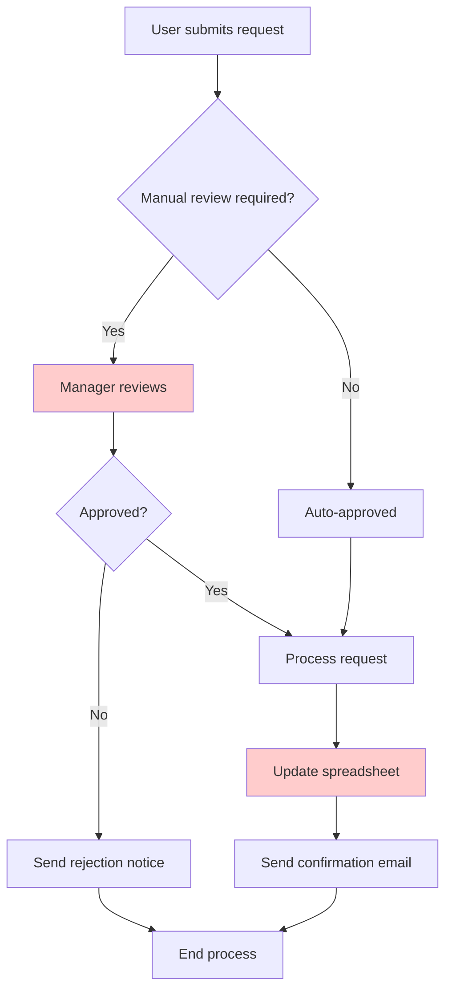
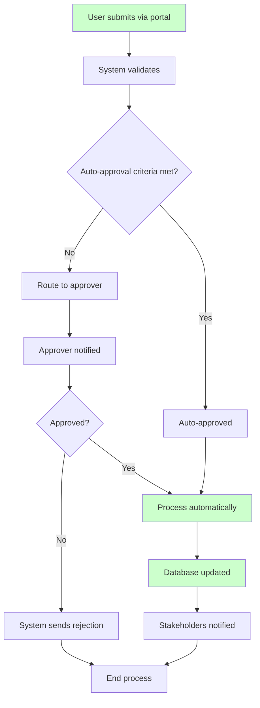

# **Task: Requirements Documentation (Business Analysis)**

Create comprehensive and clear business requirements documentation that bridges business needs with technical implementation.

## **Business Requirements Document (BRD) Structure**

### **1. Executive Summary**
- **Project Overview**: Brief description of the project and its purpose
- **Business Objectives**: Key goals and expected outcomes
- **Success Criteria**: Measurable criteria for project success
- **High-Level Timeline**: Major milestones and deadlines
- **Budget Summary**: High-level cost estimates and ROI projections

### **2. Business Case**
```markdown
## Business Case Template

### Problem Statement
Clearly describe the business problem or opportunity that the project addresses.

### Current State Analysis
- Existing processes and their limitations
- Pain points and inefficiencies
- Current systems and tools
- Resource utilization

### Proposed Solution
- High-level solution description
- Key capabilities and features
- Integration requirements
- Expected improvements

### Cost-Benefit Analysis
| Category | Current State | Proposed State | Annual Savings |
|----------|---------------|----------------|----------------|
| Labor costs | $X | $Y | $Z |
| System costs | $A | $B | $C |
| Efficiency gains | - | +D% | $E |

### Return on Investment (ROI)
- Initial investment: $XXX
- Annual benefits: $YYY
- Payback period: Z months
- 3-year NPV: $AAA
```

## **Functional Requirements**

### **1. User Stories Format**
```markdown
## User Story Template

**As a** [persona/role]
**I want** [functionality/capability]
**So that** [business value/benefit]

### Acceptance Criteria
- [ ] Given [context], when [action], then [expected outcome]
- [ ] Given [context], when [action], then [expected outcome]
- [ ] Given [context], when [action], then [expected outcome]

### Definition of Done
- [ ] Functionality implemented and tested
- [ ] Performance requirements met
- [ ] Security requirements verified
- [ ] Documentation updated
- [ ] User training materials created

### Priority: [High/Medium/Low]
### Effort Estimate: [Story Points/Hours]
### Dependencies: [List dependent stories/requirements]
```

### **2. Use Case Documentation**
```markdown
## Use Case Template

### UC-001: [Use Case Name]

**Actor**: Primary user or system
**Goal**: What the actor wants to achieve
**Preconditions**: System state before use case execution
**Success Guarantee**: System state after successful execution

#### Main Success Scenario
1. Actor does X
2. System responds with Y
3. Actor provides Z
4. System validates and processes Z
5. System returns confirmation

#### Extensions (Alternative Flows)
3a. Invalid data provided:
   1. System displays error message
   2. System prompts for correct data
   3. Return to step 3

#### Special Requirements
- Performance: Response time < 2 seconds
- Security: User authentication required
- Availability: 99.9% uptime required
```

## **Non-Functional Requirements (NFRs)**

### **1. Performance Requirements**
```yaml
performance_requirements:
  response_time:
    web_pages: "< 3 seconds"
    api_calls: "< 500ms"
    report_generation: "< 30 seconds"
    batch_processing: "< 2 hours"
  
  throughput:
    concurrent_users: 1000
    transactions_per_second: 500
    daily_data_volume: "10 GB"
  
  scalability:
    user_growth: "20% annually"
    data_growth: "50% annually"
    geographic_expansion: "3 new regions"
```

### **2. Security Requirements**
```yaml
security_requirements:
  authentication:
    method: "Multi-factor authentication"
    session_timeout: "30 minutes"
    password_policy: "Complex passwords required"
  
  authorization:
    access_control: "Role-based access control (RBAC)"
    principle: "Least privilege"
    audit_trail: "All actions logged"
  
  data_protection:
    encryption_at_rest: "AES-256"
    encryption_in_transit: "TLS 1.3"
    data_classification: "Public, Internal, Confidential, Restricted"
    compliance: ["GDPR", "CCPA", "SOX"]
```

## **Process Mapping and Analysis**

### **1. Current State Process (AS-IS)**


### **2. Future State Process (TO-BE)**


### **3. Process Improvement Analysis**
```markdown
## Process Improvement Analysis

### Current State Metrics
- Average processing time: 5 days
- Manual effort: 8 hours per request
- Error rate: 12%
- Customer satisfaction: 3.2/5

### Future State Projections
- Average processing time: 2 hours
- Manual effort: 1 hour per request
- Error rate: 2%
- Customer satisfaction: 4.5/5

### Key Improvements
1. **Automation**: 80% of requests auto-processed
2. **Real-time validation**: Immediate error detection
3. **Self-service portal**: Reduced support calls
4. **Digital audit trail**: Complete process visibility
```

## **Data Requirements**

### **1. Data Dictionary**
```yaml
data_entities:
  customer:
    description: "Customer information and profile data"
    attributes:
      customer_id:
        type: "VARCHAR(20)"
        description: "Unique customer identifier"
        constraints: ["PRIMARY KEY", "NOT NULL"]
      
      customer_name:
        type: "VARCHAR(100)"
        description: "Customer full name"
        constraints: ["NOT NULL"]
      
      email_address:
        type: "VARCHAR(255)"
        description: "Customer email address"
        constraints: ["UNIQUE", "NOT NULL"]
        validation: "Valid email format"
      
      registration_date:
        type: "TIMESTAMP"
        description: "Date customer registered"
        constraints: ["NOT NULL"]
        default: "CURRENT_TIMESTAMP"
```

### **2. Data Flow Requirements**
```markdown
## Data Flow: Customer Registration

### Source Systems
- Web portal (real-time)
- Mobile app (real-time)
- Partner API (batch, daily)

### Data Transformations
1. **Validation**: Email format, phone number format
2. **Cleansing**: Name standardization, address formatting
3. **Enrichment**: Geographic data, credit score lookup
4. **Deduplication**: Check existing customers

### Target Systems
- Customer database (primary)
- CRM system (real-time sync)
- Marketing platform (daily batch)
- Analytics warehouse (nightly)

### Data Quality Rules
- Completeness: All required fields populated
- Accuracy: Address validation via external service
- Consistency: Data format standardization
- Timeliness: Real-time updates for critical fields
```

## **Integration Requirements**

### **1. System Integration Map**
```yaml
integrations:
  authentication_service:
    type: "Real-time API"
    protocol: "REST"
    security: "OAuth 2.0"
    availability: "99.9%"
    response_time: "< 200ms"
  
  payment_gateway:
    type: "Real-time API"
    protocol: "REST"
    security: "TLS 1.3 + API Keys"
    availability: "99.95%"
    response_time: "< 1s"
  
  crm_system:
    type: "Batch integration"
    frequency: "Hourly"
    format: "JSON"
    delivery: "SFTP"
```

### **2. API Requirements**
```yaml
api_specifications:
  customer_api:
    base_url: "https://api.company.com/v1"
    authentication: "Bearer token"
    rate_limiting: "1000 requests/minute"
    
    endpoints:
      get_customer:
        method: "GET"
        path: "/customers/{id}"
        response_time: "< 200ms"
        
      create_customer:
        method: "POST"
        path: "/customers"
        validation: "Required fields, format validation"
        response_time: "< 500ms"
```

## **Compliance and Regulatory Requirements**

### **1. Data Privacy Requirements**
```markdown
## GDPR Compliance Requirements

### Data Subject Rights
- Right to access personal data
- Right to rectification of inaccurate data
- Right to erasure ("right to be forgotten")
- Right to restrict processing
- Right to data portability
- Right to object to processing

### Implementation Requirements
- Consent management system
- Data retention policies (max 7 years)
- Data deletion procedures
- Privacy impact assessments
- Data processing records
- Breach notification procedures (72 hours)
```

### **2. Audit and Compliance**
```yaml
audit_requirements:
  logging:
    user_actions: "All CRUD operations"
    system_events: "Authentication, authorization, errors"
    data_access: "Who accessed what data when"
    retention: "7 years minimum"
  
  reporting:
    access_reports: "Monthly"
    security_incidents: "Real-time"
    compliance_metrics: "Quarterly"
    audit_trail: "On-demand"
```

## **Acceptance Criteria and Testing**

### **1. User Acceptance Testing (UAT) Framework**
```markdown
## UAT Test Case Template

### Test Case ID: UAT-001
### Test Scenario: Customer Registration Process
### Priority: High

#### Pre-conditions
- User has valid email address
- System is accessible
- Registration portal is functional

#### Test Steps
1. Navigate to registration page
2. Enter customer information
3. Submit registration form
4. Verify email confirmation sent
5. Complete email verification
6. Login with new credentials

#### Expected Results
- Registration completes successfully
- Confirmation email received within 5 minutes
- User can login immediately after verification
- Customer data stored correctly in database

#### Pass/Fail Criteria
- All steps complete without errors
- Response times meet requirements
- Data validation works correctly
- Security requirements enforced
```

## **Change Management Requirements**

### **1. Training Requirements**
```yaml
training_plan:
  target_audiences:
    end_users:
      training_method: "Online modules + hands-on practice"
      duration: "4 hours"
      materials: "User guides, video tutorials"
      assessment: "Competency test required"
    
    administrators:
      training_method: "Instructor-led + certification"
      duration: "16 hours"
      materials: "Technical documentation, lab exercises"
      assessment: "Certification exam"
    
    support_staff:
      training_method: "Workshop + shadowing"
      duration: "8 hours"
      materials: "Troubleshooting guides, FAQ"
      assessment: "Practical demonstration"
```

### **2. Communication Plan**
```markdown
## Stakeholder Communication Matrix

| Stakeholder Group | Communication Method | Frequency | Content Focus |
|-------------------|---------------------|-----------|---------------|
| Executive Team | Email updates + Dashboard | Weekly | Progress, budget, risks |
| End Users | Newsletter + Training | Bi-weekly | Features, training, support |
| IT Team | Technical briefings | Daily | Implementation, issues |
| External Partners | Formal reports | Monthly | Integration, timeline |
```

## **Documentation Standards**

### **1. Document Review Process**
```yaml
review_process:
  draft_review:
    reviewers: ["Business stakeholders", "Subject matter experts"]
    timeline: "5 business days"
    criteria: ["Completeness", "Accuracy", "Clarity"]
  
  technical_review:
    reviewers: ["Solution architects", "Development leads"]
    timeline: "3 business days"
    criteria: ["Feasibility", "Integration impacts", "Security"]
  
  final_approval:
    approvers: ["Business sponsor", "IT director"]
    timeline: "2 business days"
    criteria: ["Business value", "Risk assessment", "Budget"]
```

### **2. Version Control and Maintenance**
```markdown
## Document Management

### Version Control
- Version format: Major.Minor.Patch (e.g., 1.2.3)
- Major: Significant changes to scope or approach
- Minor: Addition of new requirements or sections
- Patch: Corrections, clarifications, formatting

### Review Schedule
- Requirements documents: Quarterly review
- Process documentation: Bi-annual review
- Technical specifications: Monthly during development
- User documentation: After each release

### Change Control
- All changes must be approved by change control board
- Impact assessment required for scope changes
- Traceability matrix maintained for all requirements
- Change log updated with rationale for each modification
```
